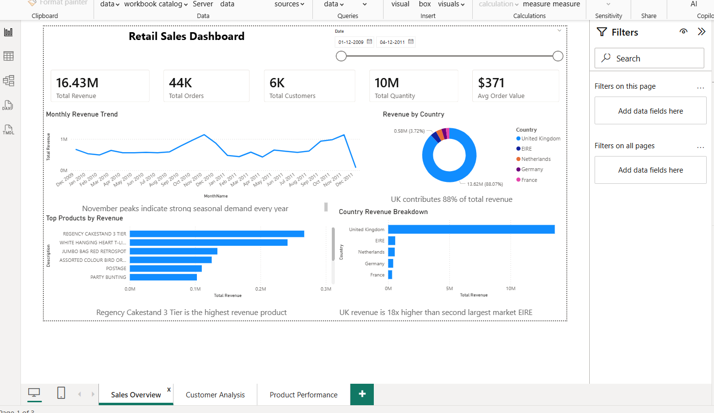
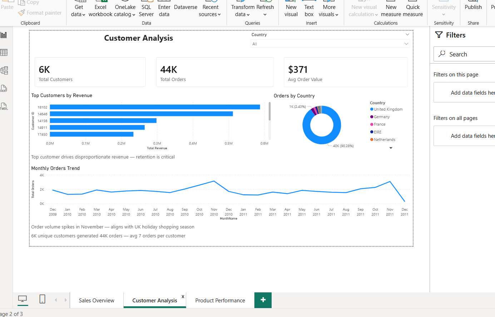
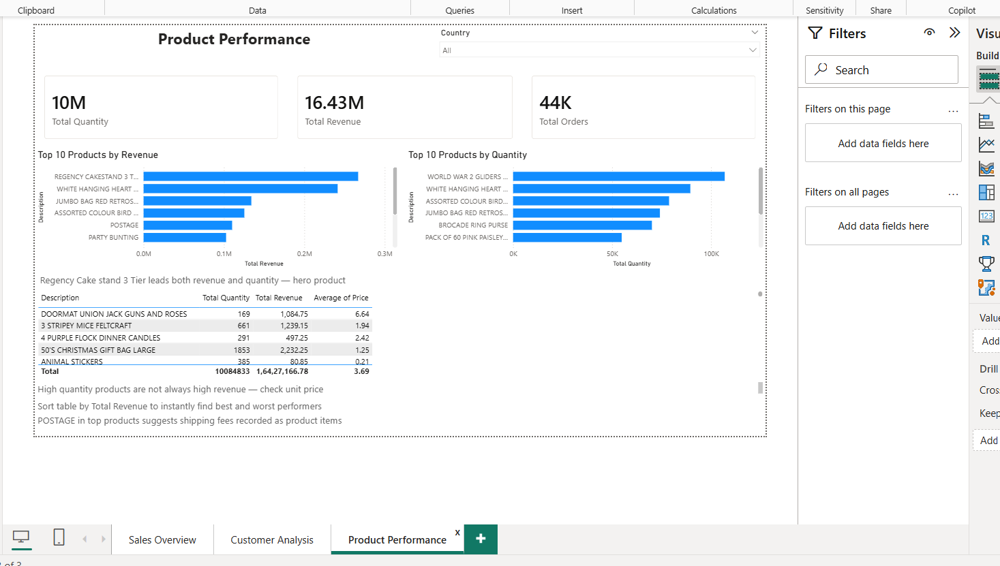

# Retail Sales Dashboard — Power BI

## Project Summary
Built a complete end-to-end 3-page interactive business 
intelligence dashboard using the Online Retail II dataset 
containing 800,000+ real transactions from a UK-based 
e-commerce company (2009–2011).

## Dashboard Pages

### Page 1 — Sales Overview

- Total Revenue: £16.43M
- Total Orders: 44K
- Total Customers: 6K
- Total Quantity Sold: 10M
- Average Order Value: $371
- Monthly revenue trend line chart
- Revenue by country donut chart
- Top 10 products by revenue
- Interactive date range slicer

### Page 2 — Customer Analysis

- Top 10 customers by revenue
- Orders by country breakdown
- Monthly orders trend over time
- Country filter slicer

### Page 3 — Product Performance

- Top 10 products by revenue vs quantity
- Full sortable product details table
- Average price per product

## Key Business Insights
- UK contributes 88% of total revenue — 
  critical geographic dependency risk
- November peaks every year — strong 
  seasonal demand pattern
- Customer 18102 is single highest 
  revenue customer — retention is critical
- Regency Cakestand 3 Tier is top product 
  by both revenue and quantity
- 6K unique customers generated 44K orders
  — average 7 orders per customer
- UK revenue is 18x higher than second 
  largest market EIRE

## Data Cleaning Steps (Power Query)
- Removed cancelled invoices (Invoice 
  starting with letter C)
- Removed rows with blank Customer ID
- Removed negative quantity rows (returns)
- Removed zero price rows
- Created Revenue column = Quantity x Price
- Changed Customer ID type from Number 
  to Text
- Changed InvoiceDate to Date type

## DAX Measures Created
- Total Revenue = SUM(Sales[Revenue])
- Total Orders = DISTINCTCOUNT(Sales[Invoice])
- Total Customers = DISTINCTCOUNT(Sales[Customer ID])
- Total Quantity = SUM(Sales[Quantity])
- Avg Order Value = DIVIDE([Total Revenue],[Total Orders])

## Data Model
- Sales table (source data — cleaned)
- CalendarTable (created using DAX)
- Relationship: CalendarTable[Date] → 
  Sales[InvoiceDate] (One to Many)

## Tools and Skills Used
- Power BI Desktop (February 2026)
- Power Query — data cleaning
- DAX — calculated measures
- Data modelling — table relationships
- Business analysis — insight generation
- Microsoft Excel — source data

## Dataset
- Name: Online Retail II
- Source: UCI Machine Learning Repository
- Rows: 800,000+ transactions
- Period: December 2009 to December 2011
- Country: United Kingdom (primary market)

## About Me
MBA in HR and Marketing | IBM Business 
Intelligence Analyst Certificate (Coursera)
Currently building skills in Excel, SQL, 
and Power BI for a career in data analytics.

Connect with me on LinkedIn: 
www.linkedin.com/in/aiswarya-rani-74694a233
